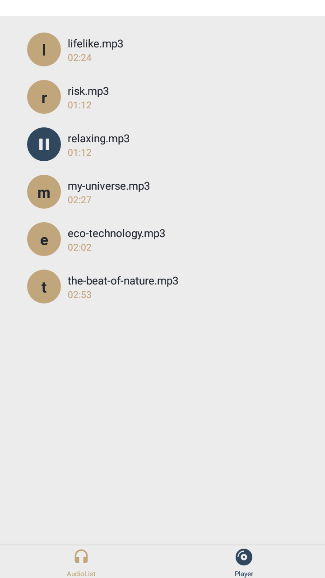
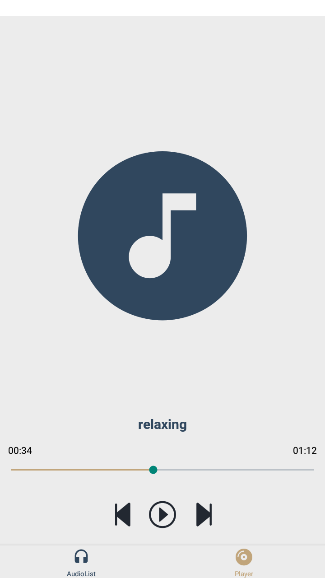

# Audio Player

## Índice

- <a href="#funcionalidades" >Funcionalidades</a>
- <a href="layout">Layout</a>
- <a href="#tecnologias-utilizadas" >Tecnologias utilizadas</a>
- <a href="como-executar">Como executar</a>
- <a href="autores">Autores</a>

## Funcionalidades

- [x] Acessar arquivos de áudio do dispositivo
- [x] Exibir os áudios em uma lista
- [x] Reproduzir/pausar áudios
- [x] Reproduzir áudio seguinte/anterior
- [x] Avançar/retroceder áudio atual 

## Layout




## Tecnologias utilizadas

- [React Native](https://reactnative.dev/)
- [Expo](https://docs.expo.dev/)

## Como executar

```
# Clone este repositório
$ git clone https://github.com/bruno743/react-native-audio-player.git

# Acesse a pasta do projeto
$ cd react-native-audio-player

# Instale as dependências
$ npm install

# Execute
$ npm run start
```
Lembrando que para a execução da aplicação em um dispositivo mobile, é preciso ter o aplicativo [Expo](https://play.google.com/store/apps/details?id=host.exp.exponent&hl=pt_BR&gl=US&pli=1) em seu telefone.

## Autores

imagem

[Linkedin](https://www.linkedin.com/in/bruno-felipe-608a85219/)
